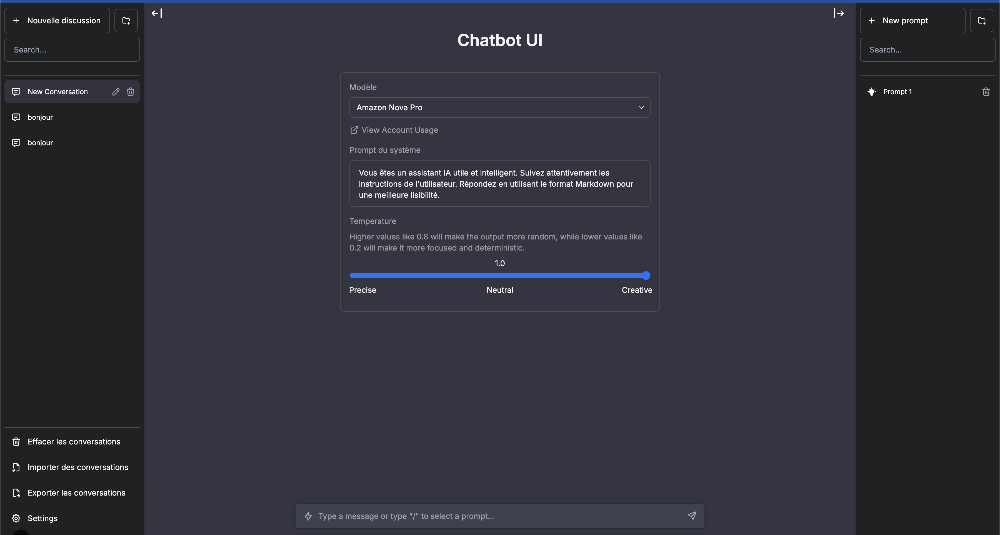
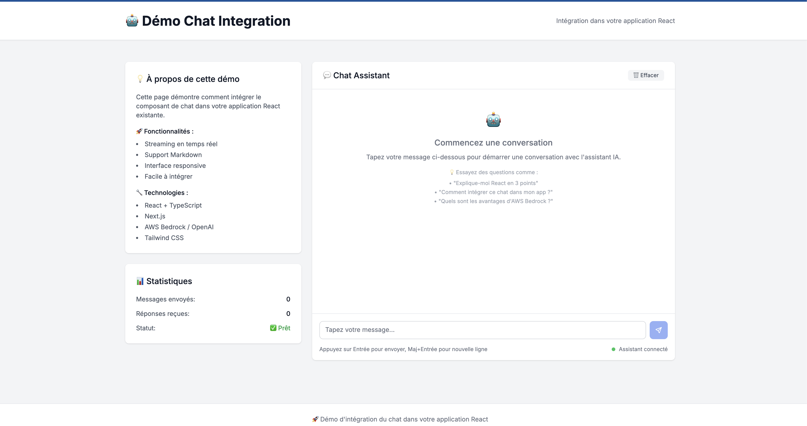

**Langue**: **Français** | [English](./README.md)

# OpenRockChat UI

> **Interface ChatGPT-like universelle : OpenAI + AWS Bedrock + RAG intégré**

[](https://vercel.com/new/clone?repository-url=https://github.com/fsayahmob/openrockchat-ui)
[](https://github.com/fsayahmob/openrockchat-ui/blob/main/LICENSE)
[](https://github.com/fsayahmob/openrockchat-ui/stargazers)


## Pourquoi OpenRockChat UI ?

**Problème** : Interfaces limitées à un seul provider (OpenAI OU Bedrock)  
**Solution** : Interface universelle qui fonctionne avec TOUS les providers IA

### Fonctionnalités Clés

- **Multi-Provider** : OpenAI + AWS Bedrock dans une seule interface
- **RAG intégré** : Knowledge Base AWS native + documents
- **Streaming configurable** : Affichage caractère par caractère OU par chunks
- **Contrôle vitesse streaming** : Effet typewriter ajustable (25ms-500ms)
- **Package React** : Intégration popup en 1 ligne de code
- **Multi-modèle** : GPT-4, Nova, Claude, Llama support
- **Switching transparent** : Change de provider sans relancer
- **Open Source** : Gratuit et personnalisable

## Pages de Démo

- **Interface Principale** : [http://localhost:3000](http://localhost:3000)
- **Démo React** : [http://localhost:3000/demo](http://localhost:3000/demo)
- **Démo Popup** : [http://localhost:3000/demo-popin](http://localhost:3000/demo-popin)

### Screenshots

| Interface Principale | Chat Streaming | Integration React |
|:---:|:---:|:---:|
|  |  |  |

## Démarrage Rapide

### 1. Installation (5 minutes)

```bash
git clone https://github.com/fsayahmob/openrockchat-ui.git
cd openrockchat-ui
npm install
```

### 2. Configuration (OpenAI OU Bedrock)

#### Option A : OpenAI (Simple)
```bash
# .env.local
OPENAI_API_KEY=votre-clé-openai
```

#### Option B : AWS Bedrock (Advanced)
```bash
# .env.local
OPENAI_API_TYPE=bedrock
AWS_ACCESS_KEY_ID=votre-access-key
AWS_SECRET_ACCESS_KEY=votre-secret-key
AWS_REGION=us-east-1
BEDROCK_KNOWLEDGE_BASE_ID=votre-kb-id
BEDROCK_MODEL_ARN=amazon.nova-pro-v1:0
```

### 3. Launch

```bash
npm run dev
# → http://localhost:3000
```

**C'est tout ! Votre interface IA universelle est prête.**

## 📚 Documentation

### 🔧 Installation Complète
- [Configuration AWS Bedrock](./docs/AWS_SETUP.md)
- [Knowledge Base Setup](./docs/KNOWLEDGE_BASE.md)
- [Variables d'environnement](./docs/ENVIRONMENT.md)

### 🎨 Intégration React
- [Package NPM](./docs/NPM_PACKAGE.md)
- [Popup Widget](./docs/POPUP_WIDGET.md)
- [Exemples d'intégration](./docs/INTEGRATION_EXAMPLES.md)

### 🚀 Déploiement
- [Déploiement Vercel](./docs/VERCEL_DEPLOY.md)
- [AWS Amplify](./docs/AWS_AMPLIFY.md)
- [Docker](./docs/DOCKER.md)

## 🆚 Comparaison

| Feature | OpenChat AI UI | ChatGPT UI | Chatbot UI | Other Solutions |
|---------|----------------|------------|------------|-----------------|
| **OpenAI Support** | ✅ | ✅ | ✅ | ✅ |
| **AWS Bedrock** | ✅ Native | ❌ | ❌ | ❌ |
| **Multi-Provider** | ✅ Switch seamless | ❌ | ❌ | ⚠️ Limité |
| **Knowledge Base** | ✅ AWS RAG | ❌ | ❌ | ⚠️ Basic |
| **Streaming** | ✅ Char-by-char | ✅ | ✅ | ⚠️ Basic |
| **React Package** | ✅ Popup widget | ❌ | ❌ | ❌ |
| **Open Source** | ✅ MIT | ✅ | ✅ | ✅ |

## 🎮 Modèles Supportés

### 🔥 OpenAI (Simple)
- ✅ GPT-4 Turbo (`gpt-4-turbo`)
- ✅ GPT-4o (`gpt-4o`)
- ✅ GPT-3.5 Turbo (`gpt-3.5-turbo`)

### ⚡ Amazon Nova via Bedrock (Recommandé)
- ✅ Nova Micro (`amazon.nova-micro-v1:0`)
- ✅ Nova Lite (`amazon.nova-lite-v1:0`) 
- ✅ Nova Pro (`amazon.nova-pro-v1:0`)

### 🧠 Anthropic Claude via Bedrock
- ✅ Claude 3.5 Sonnet (`anthropic.claude-3-5-sonnet-20241022-v2:0`)
- ✅ Claude 3 Haiku (`anthropic.claude-3-haiku-20240307-v1:0`)

### 🦙 Meta Llama via Bedrock
- ✅ Llama 3.1 (`meta.llama3-1-405b-instruct-v1:0`)
- ✅ Llama 3.2 (`meta.llama3-2-90b-instruct-v1:0`)

## 🛠️ Architecture

```
┌─────────────────┐    ┌──────────────┐    ┌─────────────────┐
│   Frontend      │───▶│   Next.js    │───▶│  AWS Bedrock    │
│   (React UI)    │    │   API        │    │  + Knowledge    │
└─────────────────┘    └──────────────┘    └─────────────────┘
        │                       │                     │
        ▼                       ▼                     ▼
┌─────────────────┐    ┌──────────────┐    ┌─────────────────┐
│   Streaming     │    │   Auth &     │    │   RAG Vector    │
│   Typewriter    │    │   Rate Limit │    │   Search        │
└─────────────────┘    └──────────────┘    └─────────────────┘
```

## 🚀 Roadmap

### ✅ Phase 1 (Actuel)
- [x] Interface ChatGPT-like
- [x] AWS Bedrock integration
- [x] Knowledge Base RAG
- [x] Streaming temps réel
- [x] Multi-modèles

### 🔄 Phase 2 (En cours)
- [ ] React NPM Package
- [ ] Authentication système
- [ ] Multi-utilisateurs
- [ ] Analytics dashboard

### 📅 Phase 3 (Q2 2024)
- [ ] Mobile responsive
- [ ] Voice input/output
- [ ] Custom model fine-tuning
- [ ] Enterprise features

## 🤝 Contributing

Nous adorons les contributions ! Voici comment participer :

### 🐛 Bug Reports
[Créer une issue](https://github.com/fsayahmob/openrockchat-ui/issues/new?template=bug_report.md)

### ✨ Feature Requests
[Proposer une feature](https://github.com/fsayahmob/openrockchat-ui/issues/new?template=feature_request.md)

### 🔧 Pull Requests
1. Fork le repo
2. Créer votre branch (`git checkout -b feature/amazing-feature`)
3. Commit vos changes (`git commit -m 'Add amazing feature'`)
4. Push to branch (`git push origin feature/amazing-feature`)
5. Ouvrir une Pull Request

## Licence

Ce projet est basé sur [OpenChat UI](https://github.com/imoneoi/openchat-ui) par imoneoi, qui est lui-même un fork de [Chatbot UI](https://github.com/mckaywrigley/chatbot-ui) par Mckay Wrigley.

- **Chatbot UI original** : MIT License © 2024 Mckay Wrigley
- **Fork OpenChat UI** : MIT License © 2024 imoneoi
- **Intégration Bedrock & OpenRockChat UI** : MIT License © 2024 Farid Sayah - [uppli.io](https://uppli.io)

Voir [LICENSE](./LICENSE) pour plus de détails.

## Support

- **Star le repo** si ça vous aide !
- **Signaler des bugs** via [Issues](https://github.com/fsayahmob/openrockchat-ui/issues)
- **Discussions** via [Discussions](https://github.com/fsayahmob/openrockchat-ui/discussions)
- **Contact** : [@fsayahmob](https://github.com/fsayahmob) | [uppli.io](https://uppli.io)

## Statistiques


---

**Créé pour la communauté AWS Bedrock**

*Open Source • Production Ready*