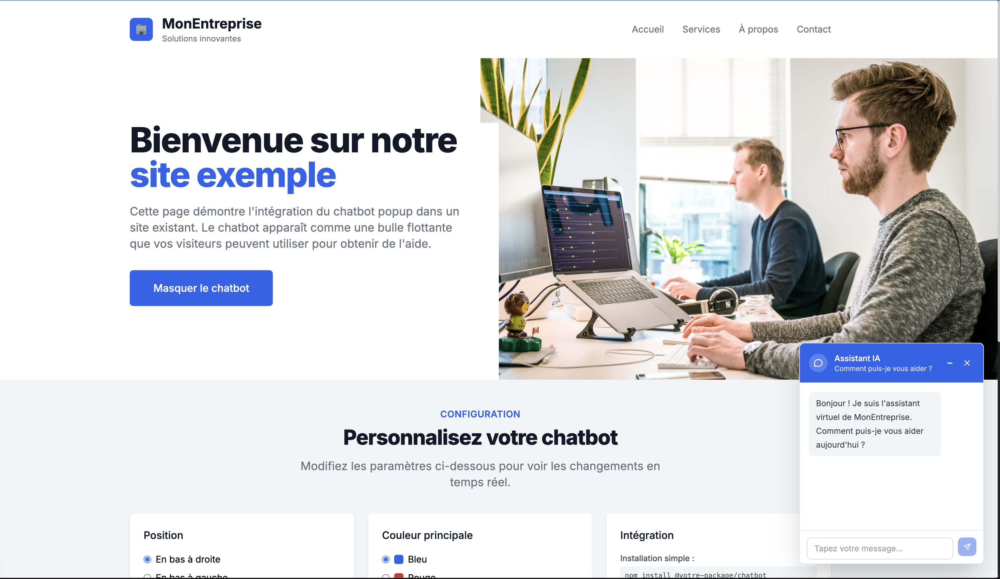
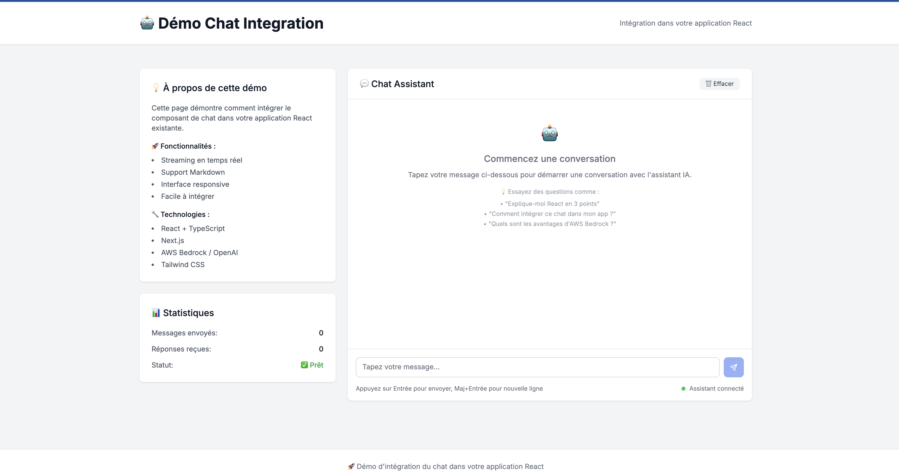

**Language**: [Français](./README-FR.md) | **English**

# OpenRockChat UI

> **Universal ChatGPT-like interface: OpenAI + AWS Bedrock + Integrated RAG**

[](https://vercel.com/new/clone?repository-url=https://github.com/fsayahmob/openrockchat-ui)
[](https://github.com/fsayahmob/openrockchat-ui/blob/main/LICENSE)
[](https://github.com/fsayahmob/openrockchat-ui/stargazers)


## Why OpenRockChat UI?

**Problem**: Interfaces limited to single provider (OpenAI OR Bedrock)  
**Solution**: Universal interface that works with ALL AI providers

### Key Features

- **Multi-Provider**: OpenAI + AWS Bedrock in one interface
- **Integrated RAG**: Native AWS Knowledge Base + documents
- **Configurable Streaming**: Character-by-character OR chunk-based display
- **Streaming Speed Control**: Adjustable typewriter effect (25ms-500ms)
- **React Package**: 1-line popup integration
- **Multi-Model**: GPT-4, Nova, Claude, Llama support
- **Transparent Switching**: Change provider without restart
- **Open Source**: Free and customizable

## Demo Pages

- **Main Interface**: [http://localhost:3000](http://localhost:3000)
- **React Demo**: [http://localhost:3000/demo](http://localhost:3000/demo) 
- **Popup Demo**: [http://localhost:3000/demo-popin](http://localhost:3000/demo-popin)

### Screenshots

| Main Interface | Streaming Chat | React Integration |
|:---:|:---:|:---:|
|  |  |  |

## Quick Start

### 1. Installation (5 minutes)

```bash
git clone https://github.com/fsayahmob/openrockchat-ui.git
cd openrockchat-ui
npm install
```

### 2. Configuration (OpenAI OR Bedrock)

#### Option A: OpenAI (Simple)
```bash
# .env.local
OPENAI_API_KEY=your-openai-key
```

#### Option B: AWS Bedrock (Advanced)
```bash
# .env.local
OPENAI_API_TYPE=bedrock
AWS_ACCESS_KEY_ID=your-access-key
AWS_SECRET_ACCESS_KEY=your-secret-key
AWS_REGION=us-east-1
BEDROCK_KNOWLEDGE_BASE_ID=your-kb-id
BEDROCK_MODEL_ARN=amazon.nova-pro-v1:0
```

### 3. Launch

```bash
npm run dev
# → http://localhost:3000
```

**That's it! Your universal AI interface is ready.**

### 4. Optional: Configure Streaming (Advanced)

```bash
# .env.local - Streaming configuration
STREAMING_MODE=character          # "character" or "chunk"
CHAR_DELAY=25                    # Delay between characters (ms)
CHUNK_SIZE=5                     # Minimum characters per chunk
BUFFER_FLUSH_INTERVAL=100        # Buffer flush interval (ms)
```

## Documentation

### Complete Installation
- [AWS Bedrock Configuration](./docs/AWS_SETUP.md)
- [Knowledge Base Setup](./docs/KNOWLEDGE_BASE.md)
- [Environment Variables](./docs/ENVIRONMENT.md)

### React Integration
- [NPM Package](./docs/NPM_PACKAGE.md)
- [Popup Widget](./docs/POPUP_WIDGET.md)
- [Integration Examples](./docs/INTEGRATION_EXAMPLES.md)

### Deployment
- [Vercel Deployment](./docs/VERCEL_DEPLOY.md)
- [AWS Amplify](./docs/AWS_AMPLIFY.md)
- [Docker](./docs/DOCKER.md)

## Comparison

| Feature | OpenRockChat UI | ChatGPT UI | Chatbot UI | Other Solutions |
|---------|----------------|------------|------------|-----------------|
| **OpenAI Support** | Yes | Yes | Yes | Yes |
| **AWS Bedrock** | Yes (Native) | No | No | No |
| **Multi-Provider** | Yes (Seamless) | No | No | Limited |
| **Knowledge Base** | Yes (AWS RAG) | No | No | Basic |
| **Streaming** | Yes (Configurable) | Yes (Basic) | Yes (Basic) | Basic |
| **React Package** | Yes (Popup) | No | No | No |
| **Open Source** | Yes (MIT) | Yes | Yes | Yes |

## Supported Models

### OpenAI (Simple)
- GPT-4 Turbo (`gpt-4-turbo`)
- GPT-4o (`gpt-4o`)
- GPT-3.5 Turbo (`gpt-3.5-turbo`)

### Amazon Nova via Bedrock (Recommended)
- Nova Micro (`amazon.nova-micro-v1:0`)
- Nova Lite (`amazon.nova-lite-v1:0`)
- Nova Pro (`amazon.nova-pro-v1:0`)

### Anthropic Claude via Bedrock
- Claude 3.5 Sonnet (`anthropic.claude-3-5-sonnet-20241022-v2:0`)
- Claude 3.5 Haiku (`anthropic.claude-3-5-haiku-20241022-v1:0`)
- Claude 3 Opus (`anthropic.claude-3-opus-20240229-v1:0`)
- Claude 3 Sonnet (`anthropic.claude-3-sonnet-20240229-v1:0`)
- Claude 3 Haiku (`anthropic.claude-3-haiku-20240307-v1:0`)

### Meta Llama via Bedrock
- Llama 3.1 405B (`meta.llama3-1-405b-instruct-v1:0`)
- Llama 3.1 70B (`meta.llama3-1-70b-instruct-v1:0`)
- Llama 3.1 8B (`meta.llama3-1-8b-instruct-v1:0`)
- Llama 3.2 90B (`meta.llama3-2-90b-instruct-v1:0`)
- Llama 3.2 11B (`meta.llama3-2-11b-instruct-v1:0`)
- Llama 3.2 3B (`meta.llama3-2-3b-instruct-v1:0`)
- Llama 3.2 1B (`meta.llama3-2-1b-instruct-v1:0`)

### DeepSeek via Bedrock
- DeepSeek R1 (`deepseek.deepseek-r1-distill-llama-70b-v1:0`)
- DeepSeek V3 (`deepseek.deepseek-v3-v1:0`)

### Mistral AI via Bedrock
- Mistral Large 2 (`mistral.mistral-large-2407-v1:0`)
- Mistral Large 2411 (`mistral.mistral-large-2411-v1:0`)
- Mistral Small (`mistral.mistral-small-2402-v1:0`)
- Mixtral 8x7B (`mistral.mixtral-8x7b-instruct-v0:1`)

**Important**: All Bedrock models must be activated in your AWS Bedrock console before use. Go to AWS Console > Bedrock > Model Access to enable models.

## Architecture

```
┌─────────────────┐    ┌──────────────┐    ┌─────────────────┐
│   Frontend      │───▶│   Next.js    │───▶│  AWS Bedrock    │
│   (React UI)    │    │   API        │    │  + Knowledge    │
└─────────────────┘    └──────────────┘    └─────────────────┘
        │                       │                     │
        ▼                       ▼                     ▼
┌─────────────────┐    ┌──────────────┐    ┌─────────────────┐
│   Streaming     │    │   Auth &     │    │   RAG Vector    │
│   Typewriter    │    │   Rate Limit │    │   Search        │
└─────────────────┘    └──────────────┘    └─────────────────┘
```

## Roadmap

### Phase 1 (Current)
- [x] ChatGPT-like interface
- [x] AWS Bedrock integration
- [x] Knowledge Base RAG
- [x] Real-time streaming
- [x] Multi-model support

### Phase 2 (In Progress)
- [ ] React NPM Package
- [ ] Authentication system
- [ ] Multi-user support
- [ ] Analytics dashboard

### Phase 3 (Q2 2024)
- [ ] Mobile responsive
- [ ] Voice input/output
- [ ] Custom model fine-tuning
- [ ] Enterprise features

## Contributing

We love contributions! Here's how to get involved:

### Bug Reports
[Create an issue](https://github.com/fsayahmob/openrockchat-ui/issues/new?template=bug_report.md)

### Feature Requests
[Propose a feature](https://github.com/fsayahmob/openrockchat-ui/issues/new?template=feature_request.md)

### Pull Requests
1. Fork the repo
2. Create your feature branch (`git checkout -b feature/amazing-feature`)
3. Commit your changes (`git commit -m 'Add amazing feature'`)
4. Push to the branch (`git push origin feature/amazing-feature`)
5. Open a Pull Request

## License

This project is based on [OpenChat UI](https://github.com/imoneoi/openchat-ui) by imoneoi, which itself is forked from [Chatbot UI](https://github.com/mckaywrigley/chatbot-ui) by Mckay Wrigley.

- **Original Chatbot UI**: MIT License © 2024 Mckay Wrigley  
- **OpenChat UI fork**: MIT License © 2024 imoneoi
- **AWS Bedrock integration & OpenRockChat UI**: MIT License © 2024 Farid Sayah - [uppli.io](https://uppli.io)

See [LICENSE](./LICENSE) for more details.

## Support

- **Star the repo** if it helps you!
- **Report bugs** via [Issues](https://github.com/fsayahmob/openrockchat-ui/issues)
- **Discussions** via [Discussions](https://github.com/fsayahmob/openrockchat-ui/discussions)
- **Contact**: [@fsayahmob](https://github.com/fsayahmob) | [uppli.io](https://uppli.io)

## Stats


---

**Made for the AWS Bedrock community**

*Open Source • Production Ready*